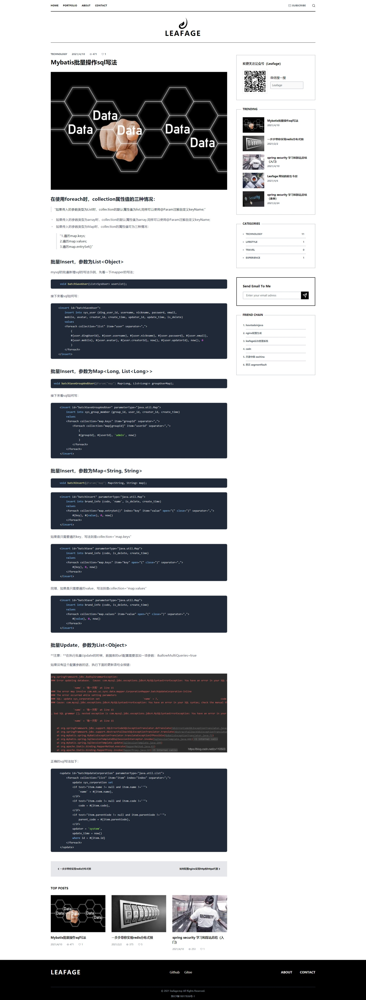

<p align="center">
  <a href="https://www.abeille.top" target="_blank">
    
  </a>
</p>

<p align="center">
  <a href="https://github.com/little3201/leafage-pw/blob/master/LICENSE">
    
  </a>
</p>

## 项目介绍

leafage-pw，一个使用 Nuxt.js、 Tailwindcss 的个人网站，致力于促进软件开发及相关领域知识与创新的传播。
包含原创博客、生活分享、资源推荐、技术总结、影视浏览等资源信息，提供原创、优质、完整内容的知识站点。

本项目是个人博客站点的源代码，markdown 数据解析使用的是markdown-it，高亮插件使用highlight.js，gihub样式。与本项目配套的还有后台管理系统（[leafage-ms](ttps://gitee.com/little3201/leafage-ms)）和后台服务（[leafage-gateway](ttps://gitee.com/little3201/leafage-gateway), [leafage-basic](ttps://gitee.com/little3201/leafage-basic)）

**后台管理系统访问地址：** https://console.leafage.top

### 更新

项目创建与 2019-05-23 历经好几次改版，虽然过程很折腾，但是也明白和体会了很多，对于一些技术点理接更深了，近期更新请查看更新日志。

[更新日志](CHANGELOG.md) 

### 目标功能
- [x] 总览
- [x] 详情
- [x] 作品集
- [x] 关于
- [X] 联系
- [ ] 点赞、分享
- [x] 分类
- [ ] 检索
- [ ] i18n

### 界面美化
- [x] 动画效果
- [x] 响应式
- [ ] 瀑布流

### 项目展示

站点地址：https://www.abeille.top

### 展示截图

首页


详情页


### 项目地址

目前项目托管在Gitee和Github平台上中，欢迎大家star 和 fork 支持~

- Gitee地址：https://gitee.com/little3201/leafage-pw
- Github地址：https://github.com/little3201/leafage-pw

## FAQ文档

[FAQ文档](FAQ.md) 

如果你遇到了 [FAQ文档](FAQ.md) 中没有出现的问题，并且已经解决了，欢迎联系我进行修改。

### 前端技术

|         技术          |           说明            |                             链接                            |
|:---------------------:|:------------------------:|:-----------------------------------------------------------:|
|        Vue.js         |         开发框架          |         [https://vuejs.org](https://vuejs.org)              |
|        Nuxt.js        |         SEO优化           |        [https://zh.nuxtjs.org](https://zh.nuxtjs.org)       |
|      Tailwindcss      |          CSS库            |       [https://tailwindcss.com](https://tailwindcss.com)    |
|         Axios         |       前端HTTP框架        |     [https://github.com/axios](https://github.com/axios)    |

## Build Setup

```bash
# install dependencies
$ yarn install

# serve with hot reload at localhost:3000
$ yarn dev

# build for production and launch server
$ yarn build
$ yarn start

# generate static project
$ yarn generate
```

<a href="LICENSE">
  <h2>MIT</h2>
</a>
