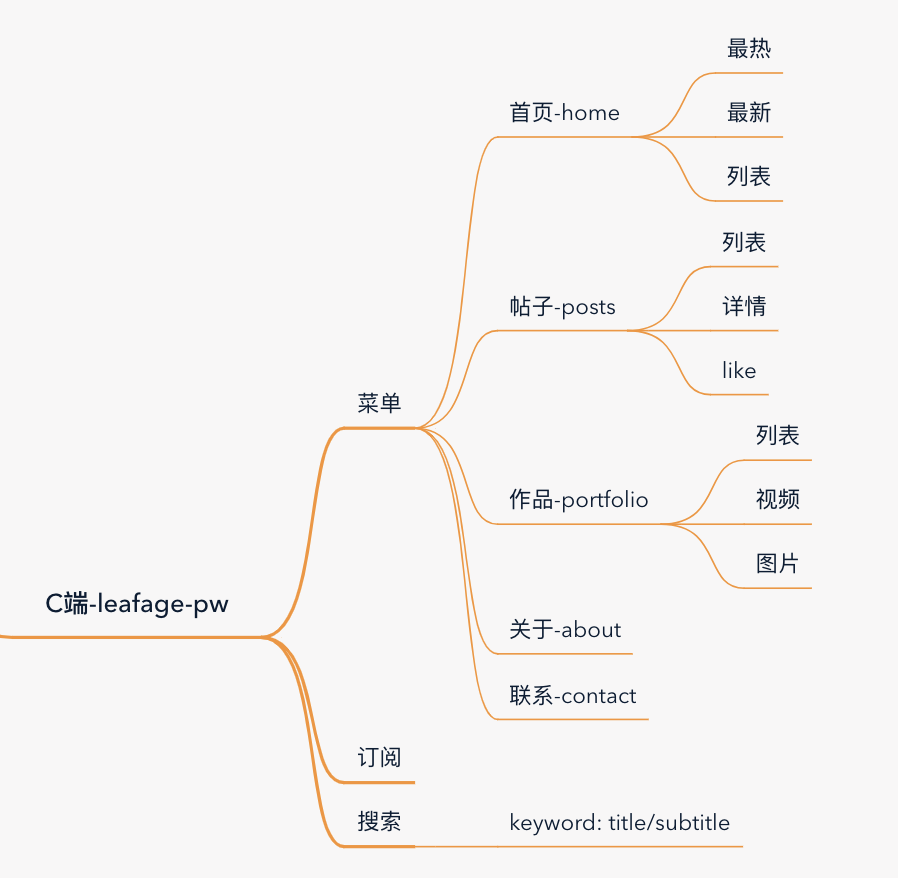

<p align="center">
  <a href="https://www.leafage.top" title="logo" target="_blank">
    
  </a>
</p>

<p align="center">
  <a href="https://github.com/little3201/leafage-pw/blob/master/LICENSE" title="github license">
    
  </a>
  
</p>

## 项目介绍

leafage-pw，一个使用 Nuxt.js、 Tailwindcss 的博客网站，项目创建之初是为了做一个个人博客，现已上线，包含原创博客、生活分享、资源推荐、技术总结、影视浏览等资源信息，提供原创、优质、完整内容的知识站点。

从一开始就决定将项目开源，因为看过wordpress，gihub pages等一些开源的博客网站的创建很不好用，而且不灵活，大家都是一套模版走天下。

虽然说网站更重要的是内容，但是既然做技术的，那为什么不把学习到的技术用于实践呢，虽然我也是后台开发，但是前端也不是有多难，而且一个博客网站不会用到很复杂的技术，就是一些html，css，javascript或者typescript的基础用法而且也都有成熟的框架或者组件供使用。

项目中的接口可以直接替换为自己的服务接口，对应的字段可以参考[leafage-basic](https://github.com/little3201/leafage-basic) ，希望大家使用本项目的同时也能一起学习，分享。

### 功能模块介绍：



本项目是博客站点的源代码，markdown 数据解析使用的是markdown-it，高亮插件使用highlight.js，gihub样式。与本项目配套的还有后台管理系统（[leafage-ms](https://github.com/little3201/leafage-ms)）和后台服务（[leafage-gateway](https://github.com/little3201/leafage-gateway), [leafage-basic](https://github.com/little3201/leafage-basic)）

**网站地址：** https://www.leafage.top

**后台管理系统访问地址：** https://console.leafage.top

### 更新

项目创建与 2019-05-23 历经好几次改版（查看[关于](https://www.leafage.top/about)了解更多），虽然过程很折腾，但是也明白和体会了很多，对于一些技术点理接更深了，近期更新请查看更新日志。

[更新日志](CHANGELOG.md) 

### 目标功能
- [x] 总览
- [x] 详情
- [x] 作品集
- [x] 关于
- [X] 联系
- [X] 点赞/喜欢
- [x] 分类
- [X] 检索
- [ ] i18n

### 界面美化
- [x] 动画效果
- [x] 响应式
- [ ] 瀑布流

## 项目展示

**首页:**


**详情页:**


### 项目地址

目前项目托管在Gitee和Github平台上中，欢迎大家star 和 fork 支持~

- Gitee地址：https://gitee.com/little3201/leafage-pw
- Github地址：https://github.com/little3201/leafage-pw

## FAQ文档

[FAQ文档](FAQ.md) 

如果你遇到了 [FAQ文档](FAQ.md) 中没有出现的问题，并且已经解决了，欢迎联系我进行修改。

### 前端技术

|         技术          |           说明            |                             链接                            |
|:---------------------:|:------------------------:|:-----------------------------------------------------------:|
|        Vue.js         |         开发框架          |         [https://vuejs.org](https://vuejs.org)              |
|        Nuxt.js        |         SEO优化           |        [https://zh.nuxtjs.org](https://zh.nuxtjs.org)       |
|      Tailwindcss      |          CSS库            |       [https://tailwindcss.com](https://tailwindcss.com)    |
|         Axios         |       前端HTTP框架        |     [https://github.com/axios](https://github.com/axios)    |

## Build Setup

```bash
# install dependencies
$ yarn install

# serve with hot reload at localhost:3000
$ yarn dev

# build for production and launch server
$ yarn build
$ yarn start

# generate static project
$ yarn generate
```

<a href="LICENSE" title="license">
  <h2>MIT</h2>
</a>
